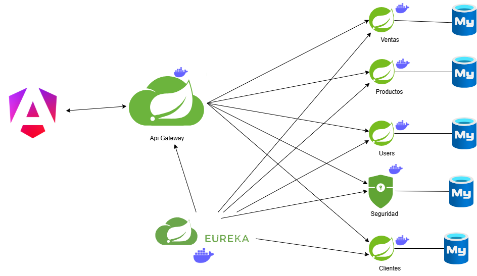

Claro, aquí tienes el contenido mejorado y en formato Markdown:

# Space-Station X 🎮👾

[](https://example.com)  
[](https://example.com)  
[](LICENSE)

Space-Station X es una plataforma modular y escalable para la administración de videojuegos, clientes, ventas y usuarios. Desarrollada con una arquitectura de microservicios utilizando **Spring Boot** para el backend y **Angular** para el frontend, el proyecto ofrece una solución robusta y segura para el comercio digital.

---

## Tabla de Contenidos
1. [Introducción](#1-introducción)
2. [Características](#2-características)
3. [Arquitectura del Sistema](#3-arquitectura-del-sistema)
4. [Tecnologías Utilizadas](#4-tecnologías-utilizadas)
5. [Microservicios](#5-microservicios)
6. [Frontend](#6-frontend)
7. [Instalación y Configuración](#7-instalación-y-configuración)
8. [Integración Continua (CI/CD)](#8-integración-continua-cicd)
9. [Contribución](#9-contribución)

---

## 1. Introducción
Space-Station X es un sistema integral diseñado para gestionar la venta de videojuegos mediante una arquitectura de microservicios. Esta solución permite manejar de forma independiente dominios como usuarios, clientes, productos y ventas, facilitando la escalabilidad y el mantenimiento del sistema.

---

## 2. Características
- **Modularidad:** Cada dominio del negocio se implementa como un microservicio independiente.
- **Escalabilidad:** Diseñado para crecer y adaptarse a nuevos requerimientos.
- **Seguridad:** Implementación de seguridad con Spring Security y JWT.
- **Interfaz Intuitiva:** Frontend moderno y responsive desarrollado en Angular.
- **Documentación Completa:** APIs documentadas con Swagger/OpenAPI.
- **Integración Continua:** Automatización del proceso de construcción y despliegue a través de GitHub Actions.

---

## 3. Arquitectura del Sistema
La solución se basa en una arquitectura de microservicios, la cual permite:
- **Desarrollo y despliegue independiente:** Cada servicio puede ser actualizado sin afectar a los demás.
- **Comunicación mediante REST APIs:** Los microservicios se comunican de forma segura y eficiente.
- **Balanceo y Gateway:** Un API Gateway centraliza las solicitudes y distribuye la carga.
- **Base de Datos Autónoma:** Cada microservicio utiliza su propia base de datos MySQL.

> **Diagrama de Arquitectura:**  
>   
> 

---

## 4. Tecnologías Utilizadas

### Backend
- **Java** con Spring Boot, Spring Data y Spring Security.
- **MySQL:** Bases de datos separadas para cada microservicio.
- **Lombok:** Para reducir código repetitivo.
- **Resilience4j:** Manejo de resiliencia en las llamadas a servicios.

### Frontend
- **Angular:** Desarrollo de la interfaz de usuario.
- **Bootstrap:** Diseño responsive.
- **RxJS:** Gestión de eventos y programación reactiva.

### Infraestructura
- **Spring Cloud Gateway:** Para balanceo de cargas y gestión del tráfico.
- **Docker:** Contenerización y despliegue simplificado (opcional).

---

## 5. Microservicios
Cada microservicio se encarga de un dominio específico:

#### Eureka Netflix
- **Funcionalidad:**  
  - Gestión centralizada de usuarios y servicios.  
  - Descubrimiento de servicios: Permite que otros microservicios se registren y se descubran dinámicamente.
- **Uso:**  
  - Proporciona endpoints para registrar y monitorizar la disponibilidad de los microservicios.
  - Facilita la escalabilidad al permitir que nuevos servicios se integren sin necesidad de reconfiguración manual.
- **Enlace:**  
  - [Ver servicio](https://eureka-server-7ls8.onrender.com/)

#### Microservice-Users
- **Funcionalidad:**  
  - Gestión integral de usuarios: registro, login, actualización y eliminación de perfiles.
  - Implementación de seguridad mediante Spring Security para proteger las rutas y gestionar permisos.
- **Uso:**  
  - Endpoints REST para la manipulación de datos de usuario.
  - Se integra con JWT para la autenticación y autorización.
- **Documentación:**  
  - [Swagger](https://yearling-eulalie-hiroshysystems01-2f7d912d.koyeb.app)  
  - Permite probar y validar la API de manera interactiva.

#### Microservice-Client
- **Funcionalidad:**  
  - Administración y gestión de clientes.
  - Permite operaciones CRUD (Crear, Leer, Actualizar y Eliminar) para la información de clientes.
- **Uso:**  
  - Asegura la integridad y consistencia de los datos de clientes a través de una base de datos dedicada.
  - Facilita la integración con otros microservicios que necesiten acceder a la información de clientes.
- **Documentación:**  
  - [Swagger](https://fatal-felicity-lourdes-74626af5.koyeb.app)

#### Microservice-Product
- **Funcionalidad:**  
  - Gestión del catálogo de videojuegos: creación, modificación, eliminación y consulta de productos.
  - Implementa funcionalidades de búsqueda avanzada, permitiendo filtrar productos por categorías u otros criterios.
- **Uso:**  
  - Incluye validaciones robustas para garantizar la integridad de los datos.
  - Maneja operaciones de inventario y actualizaciones en tiempo real.
- **Documentación:**  
  - [Swagger](https://grand-dora-hiroshyusa-4ec6d307.koyeb.app)

#### Microservice-Sales
- **Funcionalidad:**  
  - Registro y seguimiento de ventas.  
  - Proporciona herramientas para generar estadísticas y reportes de transacciones.
- **Uso:**  
  - Utiliza una base de datos independiente para almacenar el historial de transacciones y garantizar el rendimiento.
  - Permite el análisis en tiempo real para tomar decisiones basadas en datos de ventas.
- **Documentación:**  
  - [Swagger](https://technical-loise-hiroshysystems-3d94600c.koyeb.app)

#### Microservice-Security
- **Funcionalidad:**  
  - Gestión de autenticaciones y autorizaciones para asegurar el acceso a todos los microservicios.
  - Implementa mecanismos de seguridad basados en JWT para controlar y validar el acceso a los endpoints.
- **Uso:**  
  - Centraliza la verificación de credenciales y la emisión de tokens de acceso.
  - Se encarga de proteger los recursos sensibles del sistema.
- **Documentación:**  
  - [Swagger](https://biological-natalee-raydberg25-4c59dc23.koyeb.app)


---

## 6. Frontend
La aplicación Angular centraliza las funcionalidades de todos los microservicios, ofreciendo:
- **Dashboard:** Visualización de estadísticas y métricas en tiempo real.
- **Gestión Integral:** Administración de usuarios, clientes, productos y ventas.
- **Interfaz Moderna:** Diseño responsive y experiencia de usuario optimizada.

---

## 7. Instalación y Configuración

### Prerrequisitos
- **Java 17+**
- **Node.js 18+**
- **Angular CLI**
- **Docker** (opcional para contenedorización)

### Pasos para el Backend
1. **Clonar Repositorios:**
   ```bash
   git clone https://github.com/Space-Station-X/microservice-users.git
   git clone https://github.com/Space-Station-X/microservice-client.git
   git clone https://github.com/Space-Station-X/microservice-product.git
   git clone https://github.com/Space-Station-X/microservice-sales.git
   git clone https://github.com/Space-Station-X/microservice-gateway.git
   git clone https://github.com/Space-Station-X/microservice-security.git
   git clone https://github.com/Space-Station-X/eureka-server.git
   ```

2. **Configurar Bases de Datos y Variables de Entorno:**
   Revisa y ajusta los archivos de configuración o utiliza un archivo de ejemplo como `.env.example`.

3. **Ejecutar los Microservicios:**
   ```bash
   ./mvnw spring-boot:run
   ```

### Pasos para el Frontend
1. **Clonar el Repositorio:**
   ```bash
   git clone https://github.com/Space-Station-X/frontend.git
   ```

2. **Instalar Dependencias:**
   ```bash
   npm install
   ```

3. **Ejecutar la Aplicación:**
   ```bash
   ng serve
   ```

---

## 8. Integración Continua (CI/CD)
Para automatizar la construcción y despliegue del proyecto, se ha implementado un pipeline de GitHub Actions. Este pipeline realiza las siguientes tareas:

- **Verificación en Pull Requests:**
  - Checkout del repositorio, configuración de JDK 17 y compilación con Maven.
  - Verificación de la generación del JAR y construcción de la imagen Docker.

- **Construcción y Despliegue en Push:**
  - Construcción y validación del proyecto.
  - Login en Docker Hub, construcción y push de la imagen Docker.
  - Despliegue automático en servicios como Render y Koyeb mediante hooks y redeploys.

> .png)

---

## 9. Contribución
¡Las contribuciones son bienvenidas! Si deseas colaborar:

1. Clona el repositorio y crea una rama con un nombre descriptivo.
2. Realiza tus cambios siguiendo las buenas prácticas de codificación.
3. Envía un Pull Request detallando las mejoras o correcciones implementadas.
4. **Código de Conducta:** Por favor, respeta el Código de Conducta del proyecto.

---
